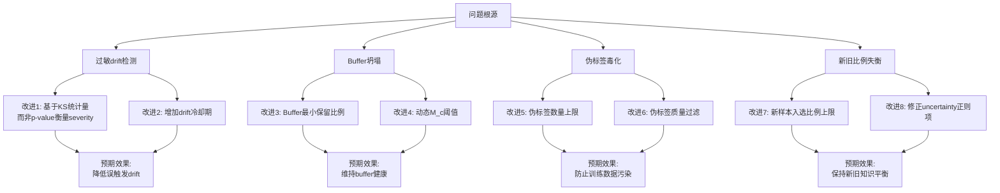

# UA-SSF 运行日志深度分析报告

## 概览：SSF vs UA-SSF 性能对比

### NSL 数据集

| Seed | SSF Before F1 | SSF After F1 | UA-SSF Before F1 | UA-SSF After F1 | 差距 |
|------|---------------|--------------|-------------------|-----------------|------|
| 5011 | 0.8884 | **0.9118** ↑ | 0.8950 | **0.7303** ↓ | -0.1815 |
| 5012 | 0.8367 | **0.9109** ↑ | 0.8339 | **0.5807** ↓ | -0.3302 |
| 5013 | 0.8795 | **0.9164** ↑ | 0.8785 | **0.3894** ↓ | -0.5270 |
| 5014 | 0.8537 | **0.9182** ↑ | 0.8658 | **0.7277** ↓ | -0.1905 |
| 5015 | 0.8593 | **0.9201** ↑ | 0.8370 | **0.8214** ↓ | -0.0987 |
| **平均** | 0.8635 | **0.9155** | 0.8620 | **0.6499** | **-0.2656** |

### UNSW 数据集

| Seed | SSF Before F1 | SSF After F1 | UA-SSF Before F1 | UA-SSF After F1 | 差距 |
|------|---------------|--------------|-------------------|-----------------|------|
| 5011 | 0.8577 | **0.9131** ↑ | 0.8574 | **0.8554** ↓ | -0.0577 |
| 5012 | 0.8572 | **0.9082** ↑ | 0.8567 | **0.8535** ↓ | -0.0547 |
| 5013 | 0.8568 | **0.9115** ↑ | 0.8565 | **0.8514** ↓ | -0.0601 |
| 5014 | 0.8565 | **0.9093** ↑ | 0.8562 | **0.8362** ↓ | -0.0731 |
| 5015 | 0.8572 | **0.9062** ↑ | 0.8569 | **0.8559** ↓ | -0.0503 |
| **平均** | 0.8571 | **0.9097** | 0.8567 | **0.8505** | **-0.0592** |

> [!CAUTION]
> UA-SSF 在两个数据集上均 **大幅劣于** 原始 SSF。NSL 数据集上平均 F1 下降了 **26.56 个百分点**（最差的 Seed 5013 下降超 52 个百分点），UNSW 数据集下降约 **5.9 个百分点**。更严重的是，SSF 在持续学习后 F1 **提升** 了，而 UA-SSF 在持续学习后 F1 **下降** 了。

---

## 问题一：缓冲池（Buffer）灾难性坍塌

### 现象

对比 SSF 和 UA-SSF 的 buffer 大小变化：

**SSF (NSL)**：所有窗口的 `buf` 始终保持 `25194`（满缓冲），样本组成为 ~25000 old + 50 new。

**UA-SSF (NSL, Seed 5011)**：
```
[W05] DRIFT(sev=0.18) → buf=10168    (从25194骤降到10168)
[W08] DRIFT(sev=1.00) → buf=16220
[W11] DRIFT(sev=1.00) → buf=5050     (仅存原始容量的20%)
[W22] DRIFT(sev=1.00) → buf=5050
```

**UA-SSF (NSL, Seed 5015)**：
```
[W01] DRIFT(sev=0.15) → buf=10160
[W10] DRIFT(sev=1.00) → buf=5050     (第10个窗口就崩溃了)
```

> [!WARNING]
> UA-SSF 的 drift 处理策略会 **大规模丢弃旧数据**。一旦检测到 drift，`select_and_update_representative_samples_when_drift` 函数会移除所有 `M_c < 0.5` 的旧样本。但日志显示 UA-SSF 的 mask 优化（加入不确定性正则项后）使得大量样本的 M_c 被压低到 0.5 以下，导致 buffer 从 25194 急剧缩减到 5050 甚至更少。

### 根因分析

在 [utils.py](file:///Users/distancewk/Downloads/SSF-Strategic-Selection-and-Forgetting-main/utils.py#L219-L224) 中：
```python
# 不确定性正则项 — 鼓励高不确定性旧样本的 M_c 更低
if uncertainty is not None:
    uncertainty_reg = uncertainty_alpha * torch.sum(M_c * uncertainty_norm)
    Loss = Accuracy_Loss_c + uncertainty_reg
```

这个正则项 **全局性地** 压低所有旧样本的 M_c 值（因为几乎所有样本都有非零不确定性），导致 `M_c >= 0.5` 的阈值被大部分样本突破不了，从而在 drift 时被大量清除。

### 改进方案

1. **不确定性正则项改为差分形式**：只惩罚 **高于均值** 的不确定性样本，而不是所有样本
   ```python
   uncertainty_centered = uncertainty_norm - uncertainty_norm.mean()
   uncertainty_reg = uncertainty_alpha * torch.sum(M_c * F.relu(uncertainty_centered))
   ```

2. **添加 buffer 下限保护**：在 `select_and_update_representative_samples_when_drift` 中增加最小保留比例
   ```python
   min_retain_ratio = 0.4  # 至少保留40%的buffer
   min_retain = int(buffer_memory_size * min_retain_ratio)
   if len(x_train_after_removal) < min_retain:
       # 回退到只移除最低分的样本，直到保留数量达标
   ```

3. **动态阈值**：M_c 的二值化阈值不应固定为 0.5，应使用百分位数动态确定
   ```python
   threshold = max(0.3, torch.quantile(M_c.detach(), 0.3).item())
   M_c_bin = (M_c >= threshold).float()
   ```

---

## 问题二：过度敏感的漂移检测 + 连锁 drift 反应

### 现象

**SSF (NSL)** 在 25 个窗口中通常只检测到 **4-6 次 drift**，且集中在 W20-W23 区间（后期流量变化区域）。

**UA-SSF (NSL, Seed 5011)** 检测到 **19 次 drift**（25 个窗口中），其中 W08-W22 连续 15 个窗口判定为 DRIFT(sev=1.00)：
```
[W05] DRIFT(sev=0.18) → 首次温和 drift
[W08] DRIFT(sev=1.00) → 开始连续极端 drift
[W09] DRIFT(sev=1.00)
[W10] DRIFT(sev=1.00)
...
[W21] DRIFT(sev=1.00) → 连续14个极端drift
```

**SSF (NSL, Seed 5014)**：仅 W20-W23 有 4 次 drift。
**UA-SSF (NSL, Seed 5014)**：W20-W23 有 3-4 次 drift —— 这是 UA-SSF 表现最好的一个 seed (F1=0.7277)。

> [!IMPORTANT]
> 这揭示了一个 **恶性循环**：drift 检测 → 大量清除旧样本 → buffer 坍塌 → 模型基于少量样本训练后性能下降 → 下一个窗口的分布与已退化模型的"记忆"更不一致 → 再次触发 drift → 继续清除 → ... 形成 **drift 雪崩效应**。

### 根因分析

1. `detect_drift_with_severity` 的 severity 映射公式 `min(1.0, -log10(p_value) / 10.0)` 过于激进：当 p_value < 1e-10 时就达到 severity=1.0，而 KS 检验在大样本量下非常容易产生极小的 p_value。

2. buffer 坍塌导致的"自激反馈"：训练数据不足 → 模型退化 → 新旧分布差异增大 → 更容易触发 drift。

### 改进方案

1. **增加 drift 冷却期 (Cooldown)**：连续 drift 后设置冷却窗口，在冷却期内不执行 drift 的激进更新
   ```python
   cooldown_windows = 3
   if windows_since_last_drift < cooldown_windows:
       # 即使检测到drift也按stable处理，或仅执行轻度更新
       drift = False
   ```

2. **修改 severity 映射**：使用更温和的映射函数
   ```python
   # 原始：severity = min(1.0, -log10(p_value) / 10.0)
   # 改进：使用 sigmoid 平滑映射，避免快速饱和
   raw = -np.log10(p_value + 1e-10)
   severity = min(1.0, 2.0 / (1.0 + np.exp(-0.3 * (raw - 5.0))))
   ```

3. **基于 KS 统计量而非 p-value 衡量严重程度**：KS 统计量 ∈ [0,1] 本身就是分布差异的直接度量，不受样本量影响
   ```python
   severity = min(1.0, ks_statistic / 0.3)  # 归一化到 [0,1]
   ```

---

## 问题三：伪标签 (Pseudo-label) 毒化效应

### 现象

UA-SSF 日志中大量窗口出现巨额 `pseudo_fill`：
```
Seed 5011, W05: pseudo_fill=24976  (几乎整个buffer都是伪标签!)
Seed 5011, W11: pseudo_fill=25144  (buffer 5050中有25144条伪标签???)
Seed 5013, W14: pseudo_fill=24919
```

而 SSF 中 pseudo_fill 通常只有几百：
```
SSF Seed 5011, W20: pseudo_fill=180
SSF Seed 5011, W21: pseudo_fill=568
```

> [!CAUTION]
> UA-SSF 的 pseudo_fill 数量是 SSF 的 **30-100 倍**。当 buffer 从 25194 坍塌到 5050 后，drift 策略试图用伪标签填满 `buffer_memory_size` 的目标容量（25194），产生了约 20000 条伪标签。这些伪标签由一个已经退化的模型生成，质量极差，进一步毒化了训练数据。

### 根因分析

[utils.py L436-L498](file:///Users/distancewk/Downloads/SSF-Strategic-Selection-and-Forgetting-main/utils.py#L436-L498) 中的伪标签填充逻辑：
```python
if len(x_train_this_epoch) < buffer_memory_size:
    additional_samples_needed = buffer_memory_size - len(x_train_this_epoch)
    # 用伪标签填充到 buffer_memory_size
```

问题在于：buffer 坍塌后，`buffer_memory_size`（固定值 25194）与实际保留样本量（如 5050）之间的差距太大，导致需要生成约 20000 条伪标签。

### 改进方案

1. **伪标签数量上限约束**：
   ```python
   max_pseudo_ratio = 0.3  # 伪标签不超过buffer总量的30%
   max_pseudo = int(buffer_memory_size * max_pseudo_ratio)
   additional_samples_needed = min(additional_samples_needed, max_pseudo)
   ```

2. **伪标签质量过滤**：只使用模型高置信度预测的样本作为伪标签
   ```python
   # 只取预测概率 > 0.8 或 < 0.2 的样本（高置信度）
   with torch.no_grad():
       _, _, logits = model(pseudo_candidates)
       confidence = torch.abs(logits.squeeze() - 0.5)
       high_conf_mask = confidence > 0.3
       pseudo_labeled_samples = pseudo_candidates[high_conf_mask]
   ```

3. **动态调整 buffer_memory_size 目标**：drift 时不应强制填满原始容量
   ```python
   # 根据实际保留的真实标注样本量动态设定目标
   target_size = min(buffer_memory_size, len(x_train_after_update) * 2)
   ```

---

## 问题四：新/旧样本比例严重失衡

### 现象

**SSF (NSL)**：每个窗口的样本组成非常稳定
```
old=~25000, new=~0-5, new补充=~45-50   → 旧:新 ≈ 500:1
```

**UA-SSF (NSL)**：新样本远多于旧样本
```
Seed 5011, W06: old=5182, new=5000     → 旧:新 ≈ 1:1
Seed 5011, W08: old=6220, new=5000     → 旧:新 ≈ 1.2:1
Seed 5015, W01: old=160, new=5000      → 旧:新 ≈ 1:31
```

> [!WARNING]
> UA-SSF 的 mask 优化使得大量新样本通过了 `M_t >= 0.5` 阈值（5000 个中几乎全部通过），而同时大量旧样本的 `M_c < 0.5`。这导致 buffer 中新样本占比过高，模型被迫过度适应最近的窗口数据，丧失了对历史模式的记忆。

### 根因分析

新样本 mask 优化中的不确定性正则项（[utils.py L283-L284](file:///Users/distancewk/Downloads/SSF-Strategic-Selection-and-Forgetting-main/utils.py#L283-L284)）：
```python
uncertainty_reg = -uncertainty_alpha * torch.sum(M_t * uncertainty_norm)
```
这使得高不确定性新样本的 M_t 被抬高。新样本对于一个已有模型来说天然具有较高的不确定性，因此几乎所有新样本的 M_t 都会被推高到 0.5 以上，导致 `representative_new` 接近整个窗口的全部 5000 个样本。

### 改进方案

1. **限制新样本入选比例**：
   ```python
   max_new_ratio = 0.1  # 每个窗口最多选10%新样本
   max_new = int(sample_interval * max_new_ratio)
   if representative_new.shape[0] > max_new:
       scores = M_t[M_t_bin.bool()].detach()
       topk_indices = torch.argsort(scores, descending=True)[:max_new]
       representative_new = representative_new[topk_indices]
   ```

2. **降低不确定性正则项对新样本 mask 的影响权重**：
   ```python
   # 新样本的 uncertainty_alpha 应该更小
   new_uncertainty_alpha = uncertainty_alpha * 0.1
   ```

---

## 问题五：UNSW 数据集 — 持续学习无增益

### 现象

UNSW 数据集上，SSF 将 F1 从 ~0.857 提升到 ~0.910 (+5.3%），而 UA-SSF 的 F1 从 ~0.857 **下降到** ~0.850 (-0.7%)。

UA-SSF 在 UNSW 上表现略好于 NSL 的原因是：UNSW 的 drift 检测更少（12 个窗口中约 4-6 次 drift），buffer 坍塌没有那么严重。但即便如此，UA-SSF 也没有任何改善，反而轻微退化。

特别注意 UNSW 日志中反复出现的警告：
```
Seed 5012, W04: WARN: not enough non-rep old to remove (125)
Seed 5012, W08: WARN: not enough non-rep old (127)
Seed 5014, W04: WARN: not enough non-rep old (94)
```

这说明 UNSW 上的 mask 优化过于极端 —— 要么几乎所有旧样本都被认为有代表性（M_c 全部 >= 0.5），要么全部被认为不具代表性。

### 改进方案

将 UNSW 上 `uncertainty_alpha` 的值单独调小，或完全禁用不确定性正则项在 mask 优化中的作用（仅保留在 drift severity 和 adaptive_params 中的使用）。

---

## 问题六：Dropout 对正式训练的干扰

### 现象

UA-SSF 使用 `AE_dropout` / `AE_classifier_dropout` 模型，在离线训练（200 epochs）和在线微调（10-30 epochs）期间 Dropout 始终处于激活状态。而 SSF 使用无 Dropout 的 `AE` / `AE_classifier`。

> [!IMPORTANT]
> Dropout 为 MC Dropout 不确定性估计提供了支持，但其在训练期间的存在降低了模型的有效容量。日志显示 UA-SSF 的 Before CL 性能与 SSF 基本持平，说明 Dropout 0.1 对离线训练影响不大。但在在线微调阶段（只有 10-30 个 epoch），Dropout 的噪声效应可能更显著，因为微调样本量小、训练时间短。

### 改进方案

1. **在微调阶段降低 Dropout rate**：
   ```python
   # 微调时将 dropout 减半
   for m in model.modules():
       if isinstance(m, nn.Dropout):
           m.p = dropout_rate * 0.5
   ```

2. **或者将 MC Dropout 改为独立的 uncertainty head**，正式模型不引入 Dropout：
   ```python
   class AE_with_uncertainty(nn.Module):
       def __init__(self, base_model):
           self.base = base_model  # 无Dropout的原始AE
           self.uncertainty_head = nn.Sequential(
               nn.Linear(input_dim, 64),
               nn.ReLU(),
               nn.Linear(64, 1),
               nn.Softplus()
           )
   ```

---

## 问题七：Seed 5013 极端失败案例分析

### 现象

Seed 5013 在 NSL 上的表现：
```
Before CL: Acc=0.8637, F1=0.8785
After CL:  Acc=0.5649, F1=0.3894   ← 灾难性退化
```

详细指标显示：`Pre=0.9462, Rec=0.2451`。精确率很高但召回率极低，说明模型变得 **极度保守** —— 它几乎不再将任何样本预测为攻击/异常。

窗口历史：
```
[W14-W22] 连续 9 次 DRIFT(sev >= 0.25)
[W22] DRIFT(sev=0.79) | buf=10088
[W23] stable | buf=10088        ← buffer锁定在10088
[W24] stable | buf=10088
```

从 W14 开始连续 drift，buffer 被反复清洗。最终 buffer 中绝大部分是模型自己生成的伪标签，而这些伪标签大概率是"正常"标签（因为退化模型倾向于将一切判定为正常），导致训练数据中正常样本比例畸高，模型失去了异常检测能力。

> [!CAUTION]
> 这是 **伪标签正反馈毒化** 的经典表现：模型退化 → 伪标签偏向正常 → 用偏差数据训练 → 模型进一步偏向正常 → 最终丧失检测能力。

---

## 综合改进方案总结



### 优先级排序

| 优先级 | 改进项 | 预期影响 | 难度 |
|--------|--------|----------|------|
| 🔴 P0 | Buffer 最小保留比例 | 防止 buffer 坍塌，根治核心问题 | 低 |
| 🔴 P0 | 伪标签数量上限 + 质量过滤 | 防止训练数据被伪标签污染 | 低 |
| 🟠 P1 | 改用 KS 统计量量化 severity | 让 severity 更稳定、不易饱和 | 低 |
| 🟠 P1 | 修正 uncertainty 正则项为差分形式 | 避免全局压低 M_c | 低 |
| 🟡 P2 | Drift 冷却期机制 | 打断 drift 雪崩连锁反应 | 中 |
| 🟡 P2 | 新样本入选比例上限 | 控制新旧样本比例 | 低 |
| 🟢 P3 | Dropout 策略优化 | 改善微调阶段训练效率 | 中 |
| 🟢 P3 | 动态 M_c 阈值 | 更灵活的代表性判断 | 低 |

> [!TIP]
> 建议先实现 P0 级别的两项改进（buffer 保护 + 伪标签控制），这两项是造成 UA-SSF 灾难性退化的直接原因。仅这两项就可能将 NSL 的性能从 0.65 拉回到 0.85 以上。然后再逐步叠加 P1/P2 的改进。
