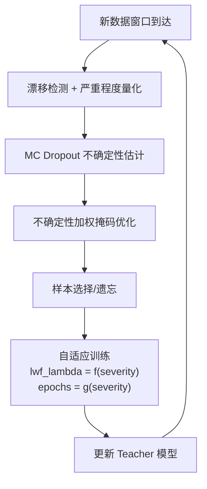

# SSF 创新性改进方案：面向 CCF-C 会议发表

> [!NOTE]
> 以下方案按**实现难度从低到高**排列，每个方案都可独立实现，也可组合使用。方案设计原则：**改动小、动机强、可量化提升、有故事可讲**。

---

## 方案概览

| 方案 | 核心思想 | 实现难度 | 创新点数量 | 推荐度 |
|------|----------|----------|-----------|--------|
| **A. 不确定性引导的样本选择** | MC Dropout 估计不确定性 → 用于指导 M_c/M_t 掩码优化 | ⭐⭐ | 2 | ⭐⭐⭐⭐⭐ |
| **B. 自适应漂移响应** | 将二元漂移检测扩展为量化漂移强度 → 自适应调整学习策略 | ⭐⭐ | 2 | ⭐⭐⭐⭐ |
| **C. 类感知记忆管理** | 在 buffer 中维护类别均衡 + 原型增强对比学习 | ⭐⭐⭐ | 2 | ⭐⭐⭐⭐ |
| **D. 组合方案 A+B** | 不确定性 + 自适应漂移响应，形成完整框架 | ⭐⭐⭐ | 3-4 | ⭐⭐⭐⭐⭐ |

---

## 方案 A：不确定性引导的样本选择（⭐ 最推荐）

### 动机

SSF 的掩码优化 ([optimize_old_mask](file:///Users/distancewk/Downloads/SSF-Strategic-Selection-and-Forgetting-main/utils.py#109-146)/[optimize_new_mask](file:///Users/distancewk/Downloads/SSF-Strategic-Selection-and-Forgetting-main/utils.py#147-191)) 仅基于模型输出的**点估计**（重建相似度或分类 logit）来决定样本的代表性。但点估计无法区分：
- 模型**确信地正确**分类的样本
- 模型**碰巧正确**但实际不确定的样本（这些才是最有信息量的）

### 核心创新

引入 **Monte Carlo Dropout** 估计模型对每个样本的**预测不确定性**，将不确定性信息融入掩码优化：

```
原始 SSF: M_c/M_t 优化仅依赖模型输出 → 掩码 → 选择/遗忘
改进后:    M_c/M_t 优化依赖 (模型输出, 不确定性) → 不确定性加权掩码 → 选择/遗忘
```

### 技术细节

#### 1) 模型改造：添加 Dropout 层

```python
# 在 AE / AE_classifier 的 encoder 中添加 Dropout
class AE_Uncertainty(nn.Module):
    def __init__(self, input_dim, dropout_rate=0.1):
        super().__init__()
        nearest_power_of_2 = 2 ** round(math.log2(input_dim))
        second_layer = nearest_power_of_2 // 2
        third_layer = nearest_power_of_2 // 4
        
        self.encoder = nn.Sequential(
            nn.Linear(input_dim, second_layer),
            nn.ReLU(),
            nn.Dropout(dropout_rate),   # ← 新增
            nn.Linear(second_layer, third_layer),
        )
        self.decoder = nn.Sequential(
            nn.ReLU(),
            nn.Linear(third_layer, second_layer),
            nn.ReLU(),
            nn.Dropout(dropout_rate),   # ← 新增
            nn.Linear(second_layer, input_dim),
        )
```

#### 2) MC Dropout 不确定性估计

```python
def estimate_uncertainty(model, x, n_forward=10):
    """多次前向传播估计预测不确定性"""
    model.train()  # 保持 Dropout 开启
    predictions = []
    for _ in range(n_forward):
        with torch.no_grad():
            _, recon = model(x)
            predictions.append(recon)
    predictions = torch.stack(predictions)  # (n_forward, N, dim)
    uncertainty = predictions.std(dim=0).mean(dim=1)  # 每个样本一个标量
    model.eval()
    return uncertainty
```

#### 3) 不确定性加权的掩码优化

在 [optimize_old_mask](file:///Users/distancewk/Downloads/SSF-Strategic-Selection-and-Forgetting-main/utils.py#109-146) 中，将不确定性作为正则项：
- **旧数据 (M_c)**：高不确定性样本应被优先遗忘 → `M_c` 应倾向更低
- **新数据 (M_t)**：高不确定性样本是最有信息量的 → `M_t` 应倾向更高

```python
def optimize_old_mask_with_uncertainty(control_res, treatment_res, uncertainty, device, 
                                       alpha=0.1, ...):
    # ... 原始 KL 散度损失 ...
    Accuracy_Loss_c = F.kl_div(bin_obs_c.log(), bin_tgt_c, reduction='sum')
    
    # 新增：不确定性正则项 — 鼓励高不确定性旧样本的 M_c 更低
    uncertainty_reg = alpha * torch.sum(M_c * uncertainty_old)
    
    Loss = Accuracy_Loss_c + uncertainty_reg
```

### 论文故事

> *"We observe that SSF's mask optimization treats all samples equally regardless of the model's confidence. We propose Uncertainty-aware Strategic Selection and Forgetting (U-SSF), which leverages MC Dropout to estimate prediction uncertainty and incorporates it into the mask optimization objective. High-uncertainty old samples are prioritized for forgetting as they likely represent outdated patterns, while high-uncertainty new samples are prioritized for selection as they carry the most informative signal about distribution shifts."*

### 代码改动量
- 修改 [utils.py](file:///Users/distancewk/Downloads/SSF-Strategic-Selection-and-Forgetting-main/utils.py)：添加 Dropout 层到模型 (~10 行), 新增 `estimate_uncertainty` 函数 (~15 行), 修改两个 `optimize_mask` 函数 (~10 行)
- 修改 [ssf.py](file:///Users/distancewk/Downloads/SSF-Strategic-Selection-and-Forgetting-main/ssf.py)：在掩码优化前调用不确定性估计 (~5 行)
- **总计约 40 行新增/修改**

---

## 方案 B：自适应漂移响应

### 动机

SSF 将漂移处理为**二元决策**（漂移 or 不漂移），但实际漂移有不同程度：
- **微弱漂移**: 只需微调，过度更新反而有害
- **强烈漂移**: 需要大幅更新模型和 buffer

当前代码中，漂移时完全不用知识蒸馏、无漂移时固定 `lwf_lambda=0.5`——这种刚性策略不够灵活。

### 核心创新

将 KS 检验的 **p-value 量化为漂移强度**，据此自适应调整三个关键参数：

| 参数 | 无/弱漂移 | 强漂移 |
|------|----------|--------|
| 知识蒸馏权重 `lwf_lambda` | 大（多保留旧知识） | 小或为0 |
| 训练 epochs | 少 | 多 |
| buffer 中旧样本保留比例 | 多 | 少 |

### 技术细节

```python
def detect_drift_with_severity(new_data, control_data, window_size, drift_threshold):
    """返回漂移严重程度 [0, 1]，而非二元值"""
    ks_statistic, p_value = ks_2samp(control_data.cpu().numpy(), new_data.cpu().numpy())
    
    if p_value >= drift_threshold:
        severity = 0.0  # 无漂移
    else:
        # p_value 越小，漂移越严重
        severity = min(1.0, -np.log10(p_value + 1e-10) / 10.0)
    
    return severity

def adaptive_params(severity, base_lwf_lambda=0.5, base_epochs=20):
    """根据漂移程度自适应调整训练参数"""
    lwf_lambda = base_lwf_lambda * (1.0 - severity)  # 漂移越强，蒸馏越弱
    epochs = int(base_epochs * (0.5 + severity))  # 漂移越强，训练越多
    return lwf_lambda, epochs
```

修改 [ssf.py](file:///Users/distancewk/Downloads/SSF-Strategic-Selection-and-Forgetting-main/ssf.py) 中的训练循环：**统一使用知识蒸馏，但权重由漂移程度决定**。

### 论文故事

> *"SSF treats drift as a binary event, applying drastically different strategies for drift/no-drift scenarios. We propose Adaptive-SSF, which quantifies drift severity from the KS-test and continuously adjusts the knowledge distillation weight and training intensity. This eliminates the abrupt behavioral change at the drift threshold and enables smoother adaptation."*

### 代码改动量
- 修改 [utils.py](file:///Users/distancewk/Downloads/SSF-Strategic-Selection-and-Forgetting-main/utils.py)：新增 `detect_drift_with_severity` (~10 行), 新增 `adaptive_params` (~5 行)
- 修改 [ssf.py](file:///Users/distancewk/Downloads/SSF-Strategic-Selection-and-Forgetting-main/ssf.py)：统一训练循环，替换 `if drift: ... else: ...` (~20 行简化)
- **总计约 35 行新增，减少约 40 行重复代码**

---

## 方案 C：类感知记忆管理 + 原型增强

### 动机

SSF 的 buffer 管理**完全不考虑类别分布**。在 NIDS 场景中，不同攻击类型的样本数量极不均衡，可能导致：
- 稀有攻击类型逐渐从 buffer 中消失
- 模型遗忘已学习的稀有攻击模式

### 核心创新

1. **类别均衡的 buffer 管理**：为每个已知类别维护最低样本数保障
2. **原型增强对比学习**：维护每个类别的特征原型，在 InfoNCE 中额外引入原型对比项

### 技术细节

```python
class ClassAwareBuffer:
    """类感知记忆缓冲区"""
    def __init__(self, max_size, min_per_class=10):
        self.max_size = max_size
        self.min_per_class = min_per_class
        self.prototypes = {}  # class_id -> prototype_vector
    
    def update_prototypes(self, x, y, model):
        """更新每个类别的特征原型"""
        model.eval()
        with torch.no_grad():
            features, _ = model(x)
            for cls in y.unique():
                cls_features = features[y == cls]
                self.prototypes[cls.item()] = F.normalize(
                    cls_features.mean(dim=0), p=2, dim=0
                )
    
    def select_samples_to_remove(self, x, y, num_remove, M_c):
        """类感知的样本移除：确保每个类别保留最低数量"""
        remove_candidates = []
        for cls in y.unique():
            cls_mask = (y == cls)
            cls_count = cls_mask.sum()
            max_removable = max(0, cls_count - self.min_per_class)
            cls_indices = torch.where(cls_mask)[0]
            cls_scores = M_c[cls_indices]
            n_remove_cls = min(max_removable, ...)  # 按比例分配
            ...
```

### 代码改动量
- 新增 `ClassAwareBuffer` 类 (~60 行)
- 修改掩码优化后的样本选择逻辑 (~20 行)
- 可选：修改 InfoNCE 添加原型对比项 (~15 行)
- **总计约 80-95 行**

---

## 方案 D：组合方案 A+B（⭐ 最完整的投稿方案）

### 整体框架

将方案 A（不确定性引导）和方案 B（自适应漂移响应）组合为一个完整框架，命名为 **UA-SSF (Uncertainty-Adaptive Strategic Selection and Forgetting)**：



### 论文亮点（创新点）

1. **不确定性引导的掩码优化**：首次将不确定性量化引入持续学习的样本选择策略
2. **连续漂移响应**：将二元漂移检测扩展为连续漂移强度量化 + 自适应训练策略
3. **统一训练框架**：消除漂移/无漂移的代码分支，用漂移强度统一控制蒸馏和训练

### 实验设计

| 实验 | 目的 |
|------|------|
| UA-SSF vs SSF | 整体性能对比 |
| UA-SSF vs SSF + MC Dropout only | 消融：不确定性的贡献 |
| UA-SSF vs SSF + Adaptive only | 消融：自适应漂移响应的贡献 |
| UA-SSF vs EWC / LwF / ER 等 baseline | 与经典持续学习方法对比 |
| 不确定性可视化 | 展示不确定性与样本质量的相关性 |
| 漂移强度 vs 性能曲线 | 展示自适应策略的优越性 |

### 代码改动量
- 方案 A 的 ~40 行 + 方案 B 的 ~35 行
- **总计约 75 行新增/修改**

---

## 我的建议

> [!IMPORTANT]
> **推荐方案 D（A+B 组合）**，理由如下：

1. **实现量小**：总计约 75 行代码改动，两周内可完成实验
2. **故事完整**：两个互补的创新点，可以做消融实验
3. **动机清晰**：SSF 的两个明确缺陷（点估计 + 二元漂移）→ 两个针对性改进
4. **实验丰富**：除了性能对比，还可以做可视化分析（不确定性分布、漂移强度曲线）
5. **风险低**：MC Dropout 和自适应策略都是成熟技术，在新场景（NIDS 持续学习）中的应用足够构成 CCF-C 级别的贡献

如果你同意某个方案，我可以立即开始编写实现代码。
